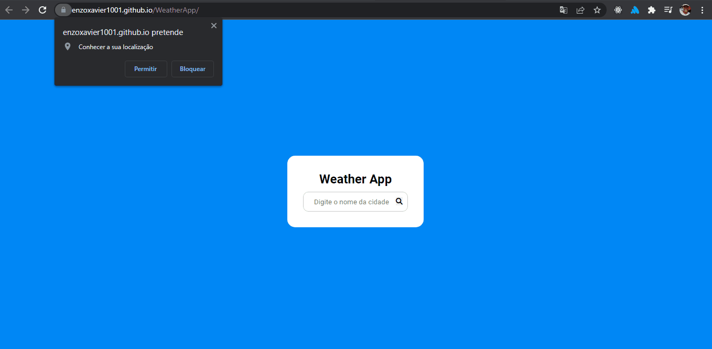

<h1 align="center">
    Weather App
</h1>

## 📃 Sobre

Desafio do repositório APP Ideas de criar uma aplicação de previsão de tempo baseado na geolocalização do usuário ou no campo de entrada.

---

## 🚀 Tecnologias utilizadas

O projeto foi desenvolvido com as seguintes tecnologias:

- HTML
- CSS
- JS

---

## 📷 Imagens

<h1 align="center">
    
</h1>

## 📁 Como baixar o projeto

```bash
    # Clonar o repositório
    $ git clone https://github.com/EnzoXavier1001/WeatherApp
    # Entrar no diretório
    $ cd WeatherApp
```
